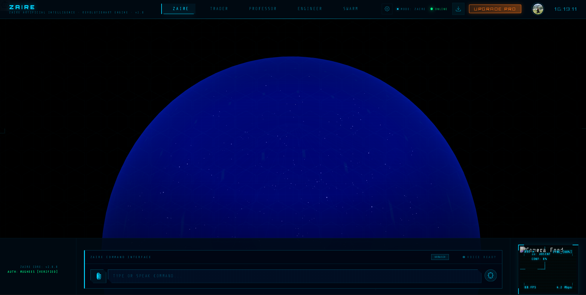
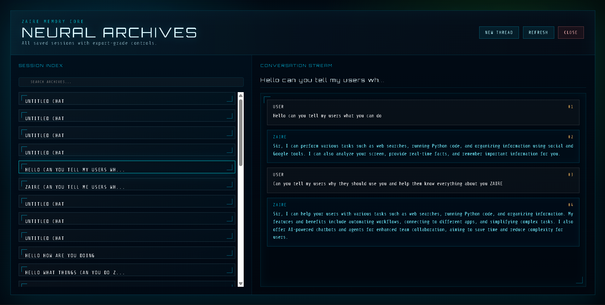
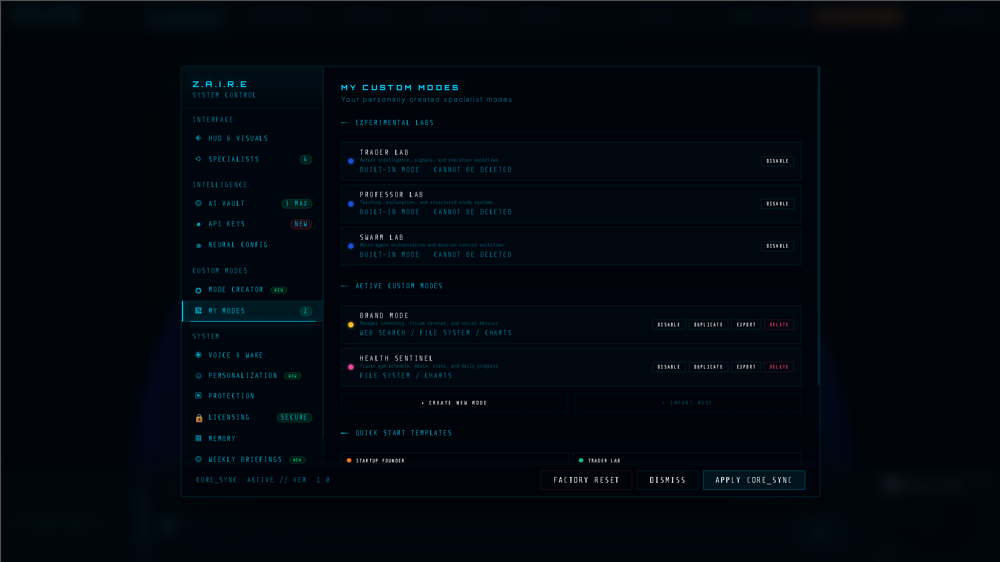

# 🧠 ZAIRE Web

<div align="center">

# ZAIRE

**The next generation AI workspace for thinking, building, researching, and creating.**

*A modern AI platform designed to provide intelligent conversations, persistent memory, powerful tools, and a seamless user experience.*


[Live Demo](#) • [Backend Repository](https://github.com/yourusername/zaire-api) • [Report Bug](../../issues) • [Request Feature](../../issues)

</div>

---

## Overview

ZAIRE is a modern AI platform built to make conversations more intelligent, productive, and personalized.

Unlike traditional chat applications, ZAIRE combines conversational AI with persistent memory, intelligent tools, and a clean user experience. It is designed to help users solve problems, organize knowledge, and complete complex tasks from one unified interface.

This repository contains the **frontend application** responsible for the complete user experience.

---

## Features

### Modern User Interface

* Clean and responsive design
* Dark mode optimized
* Mobile friendly
* Fast navigation
* Modern animations
* Beautiful typography

### AI Experience

* Multiple AI conversations
* Persistent chat history
* Markdown rendering
* Syntax highlighted code blocks
* File uploads
* Real-time responses

### Authentication

* Secure authentication
* User profiles
* Protected routes
* Session management

### Memory

* Persistent conversations
* Context-aware responses
* Conversation management

### Performance

* Server-side rendering
* Optimized routing
* Lazy loading
* Responsive layouts
* Fast page transitions

---

## Preview


Landing Page


Chat Interface



Settings



---

## Tech Stack

| Category         | Technology    |
| ---------------- | ------------- |
| Framework        | Next.js       |
| Language         | TypeScript    |
| UI               | React 19      |
| Styling          | Tailwind CSS  |
| Icons            | Lucide React  |
| Charts           | Recharts      |
| State Management | Redux Toolkit |
| Authentication   | Clerk         |
| Database         | Supabase      |
| Deployment       | Vercel        |

---

## Folder Structure

```text
zaire-web
│
├── app
│   ├── (auth)
│   ├── (dashboard)
│   ├── api
│   └── globals.css
│
├── components
│   ├── ui
│   ├── chat
│   ├── sidebar
│   ├── navbar
│   └── common
│
├── hooks
│
├── lib
│
├── services
│
├── store
│
├── types
│
├── utils
│
├── public
│
└── package.json
```

---

## Getting Started

### Clone the repository

```bash
git clone https://github.com/yourusername/zaire-web.git

cd zaire-web
```

### Install dependencies

```bash
npm install
```

### Configure environment variables

Create a `.env.local` file.

```env
NEXT_PUBLIC_API_URL=http://localhost:5000

NEXT_PUBLIC_CLERK_PUBLISHABLE_KEY=

CLERK_SECRET_KEY=

NEXT_PUBLIC_SUPABASE_URL=

NEXT_PUBLIC_SUPABASE_ANON_KEY=
```

### Start development server

```bash
npm run dev
```

The application will be available at

```
http://localhost:3000
```

---

## Production Build

```bash
npm run build
```

Run production server

```bash
npm start
```

---

## Connecting to the Backend

The frontend communicates with the ZAIRE API.

Update your environment file.

```env
NEXT_PUBLIC_API_URL=http://localhost:5000
```

or

```env
NEXT_PUBLIC_API_URL=https://your-api-domain.com
```

---

## Architecture

```text
                User
                  │
                  ▼
         ZAIRE Web (Next.js)
                  │
      REST API / WebSockets
                  │
                  ▼
        ZAIRE API (Express)
                  │
     AI Services & Database
                  │
                  ▼
        Supabase / AI Models
```

---

## Core Features

* Authentication
* Dashboard
* AI Chat
* Memory System
* Settings
* User Profiles
* File Uploads
* Conversation History
* Responsive Layout
* Theme Support

---

## Roadmap

### Version 0.1

* Basic AI chat
* Authentication
* Dashboard
* Responsive interface

### Version 0.2

* Persistent memory
* Tool calling
* Conversation management

### Version 0.3

* Advanced AI modes
* Workspace improvements
* Plugin architecture

### Future

* Voice interaction
* Vision capabilities
* Team collaboration
* Workflow automation
* Multi-agent support

---

## Contributing

Contributions are welcome.

1. Fork the repository.
2. Create a feature branch.

```bash
git checkout -b feature/my-feature
```

3. Commit your changes.

```bash
git commit -m "Add new feature"
```

4. Push your branch.

```bash
git push origin feature/my-feature
```

5. Open a Pull Request.

---

## Security

If you discover a security issue, please avoid opening a public issue.

Instead, contact the maintainers privately with enough information to reproduce the problem.

---

## License

This project is licensed under the Apache License 2.0.

See the `LICENSE` file for more information.

---

## Acknowledgements

Built using amazing open source technologies including:

* Next.js
* React
* TypeScript
* Tailwind CSS
* Clerk
* Supabase
* Lucide React

Special thanks to the open source community for creating the tools that make projects like ZAIRE possible.

---

## Author

**Mughees Siddiqui**

GitHub: https://github.com/yourusername

LinkedIn: https://linkedin.com/in/yourusername

---

<div align="center">

### ZAIRE

**Build. Think. Create.**

If you found this project helpful, consider giving it a ⭐ on GitHub.

</div>
